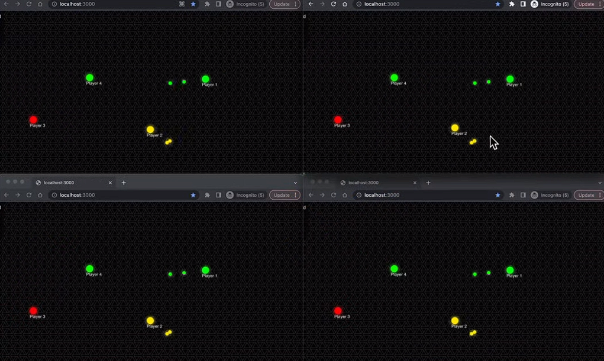

# LMG-Multiplayer

## Download and run
After downloading and extracting the files:
1. Download node modules
``` 
npm install
```
2. Run server
```
node backend.js
```
<br/>

If cloud not enabled-> Push live to Akamai (create Linode), and create server: <br/>
After enabling ssh key, run the following:
```
git copy <ssh url>
```

After this, deploy keys to the forked repository. Copy paste the previous output for this. <br/>
Run:
```
sudo apt update
sudo apt install npm
```
### To finally run the game:
```
cd LMG-Multiplayer
npm install
node backend.js
```

## Screenshot of in-game
